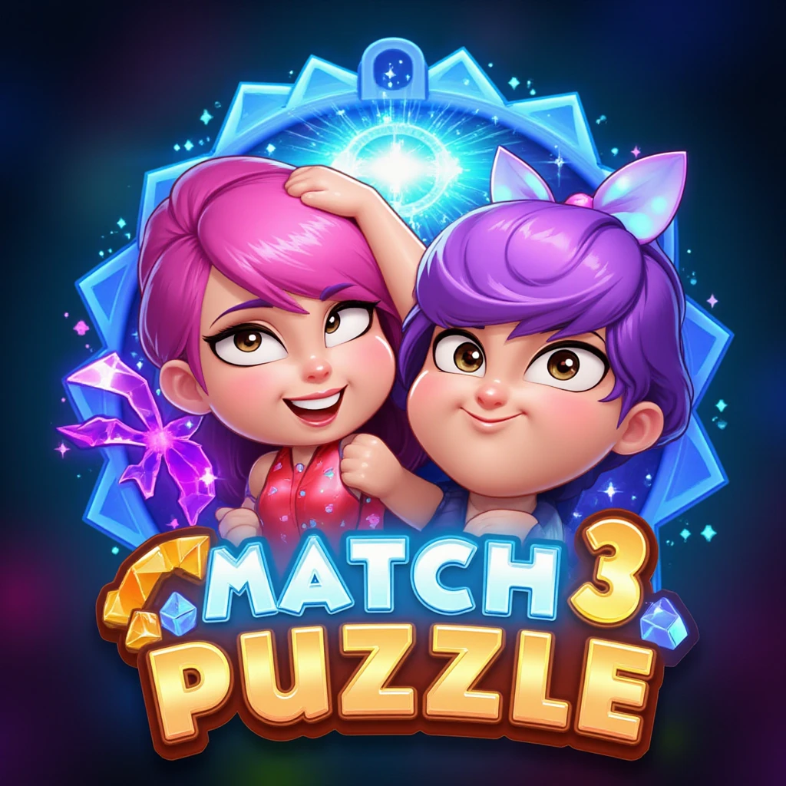

# Mono Match 3

<p align="center">
  
</p>

A complete desktop match-3 game built with C#, .NET 9, and MonoGame. The repository combines a separated board model with configurable matching rules, cascading tiles, chained special effects, state-driven application flow, and a lightweight custom framework for rendering, animation, input, timers, and reactive state.

## Highlights

- Fully playable 60-second match-3 loop with score and session high score
- Validated adjacent swaps with animated rollback for moves that create no match
- Automatic refill, falling tiles, cascades, and match processing after movement settles
- Priority-based recognition of rows, five-plus matches, and intersecting lines
- Horizontal and vertical line destroyers plus 3×3 square bombs
- Chain reactions between special tiles
- Gameplay model separated from its MonoGame presentation
- JSON-driven board, timing, scoring, layout, sprite, and VFX configuration
- Custom sprite, text, tilemap, animation, input, timer, promise, and stateful-event infrastructure

## Gameplay

1. Click one tile to select it.
2. Click an adjacent tile to attempt a swap.
3. A swap is accepted only when it creates a match; otherwise both tiles animate toward each other and return.
4. Matched tiles disappear, pieces above them fall, and empty columns refill from the top.
5. New matches are resolved after movement completes, allowing cascades and special-tile chains.
6. Score as many points as possible before the 60-second timer expires.

The default board is `8 × 8` and generates five tile colours. A direct match scores `10` points per removed tile; tiles destroyed by a special score `5` points each.

## Matching Rules

Rules are evaluated from most specific to most general, so a larger pattern is not consumed by a simpler three-tile check.

| Pattern | Result |
| --- | --- |
| Exactly 3 in a row | Removes the matched tiles |
| Exactly 4 horizontally | Creates a horizontal line destroyer |
| Exactly 4 vertically | Creates a vertical line destroyer |
| 5 or more in a row | Creates a square bomb |
| Intersecting horizontal and vertical lines of 3+ | Creates a square bomb |

Special effects:

- **Horizontal line destroyer** clears tiles to the left and right across its row.
- **Vertical line destroyer** clears tiles above and below it in its column.
- **Square bomb** clears the surrounding `3 × 3` area, clipped to the board boundaries.

Special tiles activate when matched or hit by another special, enabling chained board clears.

## Architecture

The solution is split into three projects with distinct responsibilities:

| Project | Responsibility |
| --- | --- |
| [`MonoMatch3Core`](MonoMatch3Core) | Board state, swaps, falling, match detection, scoring events, tile types, and special effects |
| [`MonoGameLibrary`](MonoGameLibrary) | Reusable MonoGame infrastructure for graphics, input, stateful events, promises, and timers |
| [`MonoMatch3`](MonoMatch3) | Application states, views, content, configuration, score flow, and the executable entry point |

```text
Mouse input
    │
    ▼
BoardInput ──> Board model ──> Match checkers ──> Tile/special lifecycle
                   │                                  │
                   ├─ stateful events                 ├─ score events
                   └─ tile state/position             └─ timed effects
                              │
                              ▼
                       Board and Tile views
                              │
                              ▼
                         RenderSystem
                 sprites · text · tilemaps · VFX
```

### Board model

[`Board`](MonoMatch3Core/Board/Board.cs) owns the position-to-tile dictionary and coordinates input, tile creation, removal, replacement, falling, refill, and special effects. Tiles publish position and movement changes through stateful events, allowing the view to animate changes without owning game rules.

[`TileBase.TrySwap`](MonoMatch3Core/Tiles/TileBase.cs) performs a reversible model swap, asks the match aggregator whether either position produces a valid result, and either starts the real movement or restores the original positions and raises a failed-move event.

### Match pipeline

[`Aggregator`](MonoMatch3Core/MatchChecker/Aggregator.cs) evaluates specialized checkers in priority order:

1. Cross-shaped intersections
2. Five-or-more horizontal and vertical rows
3. Four-tile horizontal and vertical rows
4. Three-tile horizontal and vertical rows

Checkers support a `CheckOnly` mode for swap validation and a `CheckAndConfirmChanges` mode for applying removals or upgrades. This keeps detection and mutation in one rule set without applying speculative moves.

### Model/view separation

[`MonoMatch3.View.Board`](MonoMatch3/View/Board.cs) listens for tile creation, removal, and selection changes. Each [`Tile`](MonoMatch3/View/Tile.cs) subscribes to its model's position and movement state, maps tile type and colour to configured graphics, and owns only presentation behaviour.

Gameplay timing and screen transitions are handled by explicit states:

```text
MainMenu ──> Gameplay ──> GameOver ──> MainMenu
```

The in-memory [`ProfileState`](MonoMatch3/ProfileState.cs) carries the latest and highest scores between those states for the current process.

## Custom MonoGame Infrastructure

The repository includes a compact reusable layer rather than placing all behaviour directly in the main `Game` class:

- [`RenderSystem`](MonoGameLibrary/Graphics/RenderSystem.cs) provides one ID-based API for sprites, text, tilemaps, transforms, animations, and removal.
- [`AtlasLoader`](MonoGameLibrary/Graphics/AtlasLoader.cs) loads sprite metadata and textures into a shared sprite pool.
- [`TilemapRenderer`](MonoGameLibrary/Graphics/TilemapRenderer.cs) renders JSON-defined tilemaps through the same sprite backend.
- [`SpriteAnimationBase`](MonoGameLibrary/Graphics/SpriteAnimations/SpriteAnimationBase.cs) supports composable scale, colour, transparency, rotation, and offset animations.
- [`StatefulEventInt`](MonoGameLibrary/StatefulEvent/StatefulEventInt.cs) combines retained values with change notifications for model-to-view updates.
- [`Timer`](MonoGameLibrary/Timers/Timer.cs) schedules frame-driven delays, conditions, progress callbacks, and cancellation.
- [`Deferred`](MonoGameLibrary/Promises/Deferred.cs) provides promise-style completion, failure, chaining, `All`, `Race`, and `Sequence` operations.
- [`InputManager`](MonoGameLibrary/Input/InputManager.cs) tracks mouse transitions and creates interactive screen buttons.

## Data-Driven Configuration

[`Settings.json`](MonoMatch3/Content/Settings.json) controls:

- Board width, height, and generated colours
- Direct-match and special-destruction scores
- Session duration and all gameplay/animation timings
- Board and UI screen positions
- Sprite atlases, tilemap, font, and VFX identifiers
- Per-type and per-colour tile presentation

The MonoGame content pipeline is defined in [`Content.mgcb`](MonoMatch3/Content/Content.mgcb).

## Technology

- C#
- .NET `9.0`
- MonoGame DesktopGL `3.8.x`
- MonoGame Content Builder
- `System.Text.Json`

## Getting Started

### Prerequisites

- [.NET 9 SDK](https://dotnet.microsoft.com/download/dotnet/9.0)
- Desktop platform supported by MonoGame DesktopGL

### Build and run

```bash
git clone https://github.com/ScroodgeM/MonoMatch3.git
cd MonoMatch3
dotnet restore MonoMatch3.sln
dotnet run --project MonoMatch3/MonoMatch3.csproj
```

To create a release build:

```bash
dotnet build MonoMatch3.sln --configuration Release
```

NuGet restores the MonoGame runtime and content-builder packages. The content project is processed automatically during the application build.

## Project Structure

```text
MonoMatch3/
├── MonoMatch3Core/
│   ├── Board/               Board lifecycle, input, and tile factory
│   ├── Data/                Settings, positions, movement state, and board area
│   ├── MatchChecker/        Prioritized pattern-detection rules
│   ├── Specials/            Timed line and area destruction
│   └── Tiles/               Simple and special tile behaviour
├── MonoGameLibrary/
│   ├── Graphics/            Rendering, atlases, tilemaps, and animations
│   ├── Input/               Mouse state and screen buttons
│   ├── Promises/            Deferred asynchronous composition
│   ├── StatefulEvent/       Retained observable values
│   └── Timers/              Game-loop-driven scheduling
└── MonoMatch3/
    ├── Content/             JSON configuration and game assets
    ├── States/              Main menu, gameplay, and game-over flow
    └── View/                Board, tile presentation, and VFX
```

## Scope

This repository focuses on the complete local gameplay loop and supporting framework. Persistent profiles, audio, touch input, level progression, automated tests, hints, shuffling when no moves remain, and production analytics are outside the current scope.

## License

The project is released under the [MIT License](LICENSE).
